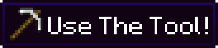

<h2>
<b>A simple, light-weight mod that requires the player to use the correct tool to mine a block</b>
</h2>
 

 

# TL;DR

---
Prevents the player from mining a block if the item they are using is not the correct tool for the job.

## License

---
This project is under an MIT license